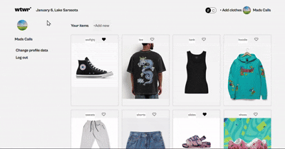

# WTWR App Fully Deployed

Node.js, Express, MongoDB, Mongoose, ESLint, React, Google Cloud, Nginx, pm2, certbot

### This project is a fully functioning live website deployed to the internet with a free domain. Able to harbor users and their items. Also with like and unlike ability. It is reactive to the geographical location of the users weather.

###

Functionality

## Created and configured a server

## Uses pm2 to keep servers live

## Registered & Certified domains with certbot

## Configured ports with nginx to create a reverse proxy server

Ultimatley leaving us with a live working social platform that can:

## Create, retrieve, and delete clothing items

## Manage user data

## Allow users to like or unlike items

## Validating data and handling errors gracefully

# Usage demo

[Quick Run Through](https://docs.google.com/document/d/1tmAa4CjFRGFr6FDyLFDK7JwSZZi2PI0yscsTKtAFz2s/edit?tab=t.0)

## Final Deployment Overview

[<svg xmlns="http://www.w3.org/2000/svg"
     width="24"
     height="24"
     viewBox="0 -960 960 960"
     fill="#e3e3e3">
<path d="M240-320h320v-22q0-44-44-71t-116-27q-72 0-116 27t-44 71v22Zm160-160q33 0 56.5-23.5T480-560q0-33-23.5-56.5T400-640q-33 0-56.5 23.5T320-560q0 33 23.5 56.5T400-480ZM160-160q-33 0-56.5-23.5T80-240v-480q0-33 23.5-56.5T160-800h480q33 0 56.5 23.5T720-720v180l160-160v440L720-420v180q0 33-23.5 56.5T640-160H160Z"/>
</svg>](https://www.loom.com/share/5ddd8b07097c4baa857fddbd9beccef7)

### Deployed Projects Domain:

#### mcallahanse.jumpingcrab.com

### Frontend Github repo:

#### https://github.com/madscalls/se_project_react
